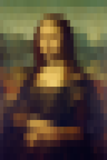
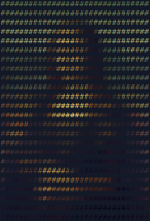
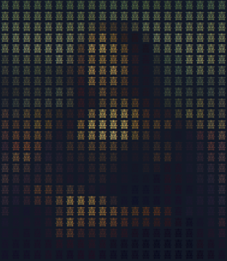

# ansi_image
A Rust utility to print an image as an ANSI string in the console. Supports UTF-8 characters.



By default, the image will take up the vertical space in the console but a size can be specified. The image can be rendered in characters if desired.

## Operation

Run ansi_image with the name of an image file to print it to the console: `./ansi-image mona_lisa.jpg`

Run with ```--help``` to get a list of parameters:
```
Usage: ansi_image [OPTION] [IMAGE FILE]

Options:
        --help          How to use this program.
    -v, --verbose       Verbose output
    -r                  Background reverse
    -b                  Blink
    -x NUMBER           Output width, in characters.
    -y NUMBER           Output height, in characters.
    -c CHARACTER        Character
        --font-width    Font width, in pixels
        --font-height   Font height, in pixels
```

### -c Character
By default the image is rendered using spaces, but a character can be used instead with the `-c` parameter.

```./ansi_image -c `#` monal_lisa.jpg```


### -r Reverse
This flag is useful with the `-c` flag. It renders the given character in the foreground colour, and the image with the background colour.

```./ansi_image -c -r `#` monal_lisa.jpg```


### -x -y Output Size

By default, the image will take up the vertical space in the console. The size of the output, in charactes, can be given by the `-x` and `-y` parameters. The image aspect ratio will be maintained.

```./ansi_image -y 14 mona_lisa.jpg```


### --font-width --font-height

By default, the utility assumes the console characters are 8x16 pixels. If the console's font dimensions are different, the size can be set with `--font-width` and `--font-height`. 

Being able to explicitly set the font size is also useful fro rendering non-ASCII UTF-8 characters, which may be wider.

```./ansi_image -c 喜 --font-width 12 mona_lisa.jpg```


### -v Verbose
Prints information about the image and how it is being processed.

### -b Blink
The blink option is included purely out of spite towards the W3C and their [rejection](https://www.w3.org/2021/04/pressrelease-blink.html.en) of the `<blink>` tag.

## Caveats

- Only tested on a handful of images. It uses the excellent Rust [Image crate](https://crates.io/crates/image) to get the pixel colours, so should work with common image formats.
- Console is not tested for ANSI capability.
- Not tested on a Mac.
- Very large images are slow to render.
- No, animated GIFs don't work.

